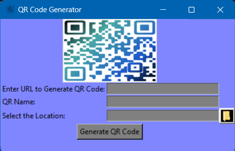

# QR Code Generator

QR Code Generator is a Python application that allows you to create QR codes from URLs and save them as SVG files.

## How to Use

1. Clone the project to your computer or download it as a zip file.

2. Python 3 must be installed. If it's not installed, you can download it from the [Python download page](https://www.python.org/downloads/).

3. Install the required Python library using the following command:

pip install pyqrcode

4. Run the application by executing the `qr_code_generator.py` file.

5. Enter the URL you want to convert into a QR code in the "Enter URL to Generate QR Code" field.

6. Provide a name for the QR code in the "QR Name" field.

7. Click the "Select the Location" button to specify where you want to save the generated QR code.

8. Click the "Generate QR Code" button to create the QR code.

## Screenshot

**Note:** This application is designed for generating QR codes from URLs and is for educational purposes only. Make sure you have the necessary rights to use and distribute QR codes generated with this tool.

If you would like to contribute to the development of the project, please feel free to submit a pull request or report any issues.
